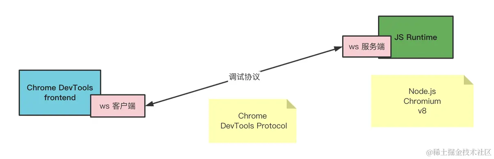
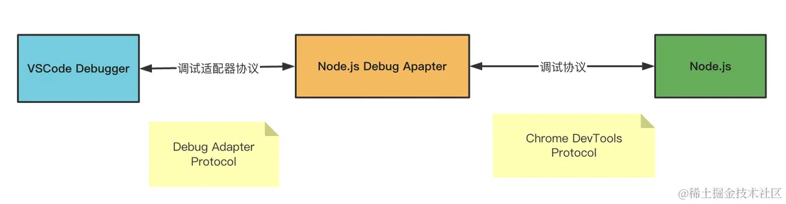
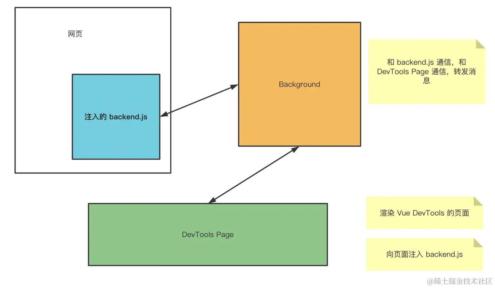
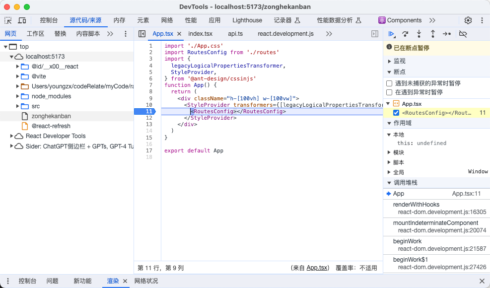
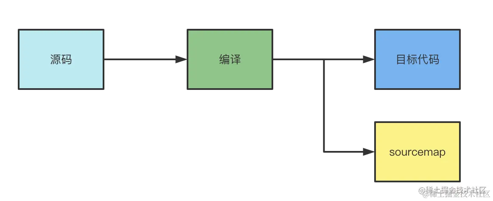
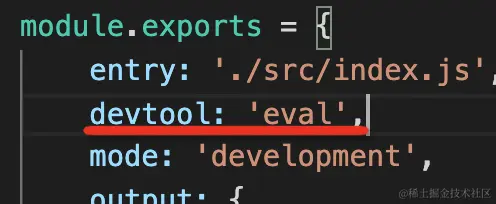
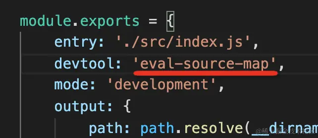
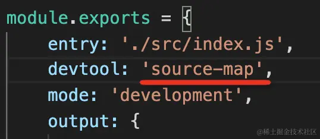
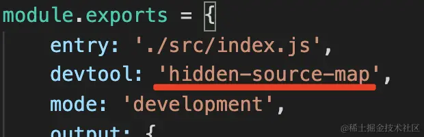

# debug

## 概述

- vscode debug 用 VSCode Debugger 调试网页的 JS
- 用 VSCode Debugger 调试 Node.js
- 用 Chrome DevTools 调试网页
- 调试工具的原理

### 1. 调试原理

##### Chrome DevTools 原理

- backend 和 Chrome 集成，负责把 Chrome 的网页运行时状态通过调试协议暴露出来。
- frontend 是独立的，负责对接调试协议，做 UI 的展示和交互。
- 传输协议数据的方式叫做信道（message channel），有很多种，比如 Chrome DevTools 嵌入在 Chrome 里时，两者通过全局的函数通信；当 Chrome DevTools 远程调试某个目标的代码时，两者通过 WebSocket 通信。
- 两者之间的调试协议叫做 Chrome DevTools Protocol，简称 CDP。
  

##### VSCode Debugger 原理

- 相较于 Chrome DevTools 多了一层适配器协议。
  

##### Vue/React DevTools

- Chrome 插件中可以访问网页的 DOM 的部分叫做 Content Script，随页面启动而生效，可以写一些操作 DOM 的逻辑。还有一部分是后台运行的，叫做 Background，浏览器启动就生效了，生命周期比较长，可以做一些常驻的逻辑。
  

### 2. 如何调试网页的 JS

- sourceCode 打断点在刷新页面：可以在右边看到 local 和 global
  

- 使用 vscode debugger 的 launch chrome

### 3. VSCode Chrome Debugger 配置

- 创建 Chrome Debug 配置有两种方式：launch 和 attach（体现在 request 的配置上）
  - launch 的意思是把 url 对应的网页跑起来，指定调试端口，然后 frontend 自动 attach 到这个端口。
- userDataDir：用户数据目录有个特点，就是只能被一个 Chrome 实例所访问，如果你之前启动了 Chrome 用了这个默认的 user data dir，那就不能再启动一个 Chrome 实例用它了。如果用户数据目录已经跑了一个 Chrome 实例，再跑一个候会报错(默认是 true，代表创建一个临时目录来保存用户数据每次要重新登陆,也可以设置为 false，使用默认 user data dir 启动 chrome)
- runtimeExecutable：指定开发者用的每日构建版，能够快速体验新特性，但是不稳定。
- runtimeArgs：启动 Chrome 的时候，可以指定启动参数，
  - 每次打开网页都默认调起 Chrome DevTools，就可以加一个 --auto-open-devtools-for-tabs 的启动参数
  - 无痕模式启动，也就是不加载插件，没有登录状态，就可以加一个 --incognito 的启动参数
- sourceMaps: 方便调试源码，默认打开，关闭设置为 false
- sourceMapPathOverrides：对 sourcemap 到的路径再做一次映射到本地

### 4. sourcemap

##### 什么是sourcemap

- sourcemap 是关联编译后的代码和源码的，通过一个个行列号的映射。
- 比如编译后代码的第 3 行第 4 列，对应着源码里的第 8 行第 5 列这种，这叫做一个 mapping
- 格式

  ```js
  {
  　　　　version : 3,
  　　　　file: "out.js",
  　　　　sourceRoot : "",
  　　　　sources: ["foo.js", "bar.js"],
  　　　　names: ["a", "b"],
  　　　　mappings: "AAgBC,SAAQ,CAAEA;AAAEA",
      sourcesContent: ['const a = 1; console.log(a)', 'const b = 2; console.log(b)']
  }
  //version：sourcemap 的版本，一般为 3
  //file：编译后的文件名
  //sourceRoot：源码根目录
  //names：转换前的变量名
  //sources：源码文件名
  //sourcesContent：每个 sources 对应的源码的内容
  //mappings：一个个位置映射
  ```

- 比如 AAAAA 一共五位，分别有不同的含义：
  - 转换后代码的第几列（行数通过分号 ; 来确定）
  - 转换前的哪个源码文件，保存在 sources 里的，这里通过下标索引
  - 转换前的源码的第几行
  - 转换前的源码的第几列
  - 转换前的源码的哪个变量名，保存在 names 里的，这里通过下标索引
- 但是线上报错的时候确实也需要定位到源码，这种情况一般都是单独上传 sourcemap 到错误收集平台。

##### sourcemap如何产生

- 编译工具在生成代码的时候也会生成 sourcemap
- AST 中保留了源码中的位置，这是 parser 在 parse 源码的时候记录的。
- 进行 AST 的各种转换之后会打印成目标代码，打印的时候是一行行一列列的拼接字符串，这时候就有了目标代码中的位置
- 这两个位置一关联，就是一个 mapping


##### 生成source-map

- 安装source-map的包
  - 创建一个 SourceMapGenerator 对象
  - 通过 addMapping 方法添加一个映射
  - 通过 toString 转为 sourcemap 字符串

### 5. webpack的sourceMap配置

##### eval-nosources-cheap-module-source-map

##### hidden-source-map

##### eval

- 通过在eval中加入sourceURL或sourceMappingURL来指定
- sourceURL映射单文件，sourceMappingUR映射多文件
- //# sourceURL=eval.js
- //# sourceMappingURL=eval.js
- webpack 就利用了 eval 这个特性来优化的 sourcemap 生成的性能，比如你可以指定 devtool 为 eval，生成的代码就是每个模块都被 eval 包裹的，并且有 sourceUrl 来指定文件名
  
- 因为只要指定个文件名就行，不用生成 sourcemap。sourcemap 的生成还是很慢的，要一个个 mapping 的处理，做编码之类的。
- 每个模块的代码都被 eval 包裹，那么执行的时候就会在 sources 里生成对应的文件，这样就可以打断点了
- 可以通过开启sourceMap来关联源码
  

##### source-map

- source-map 的配置是生成独立的 sourcemap 文件
  
- 可以关联，也可以不关联，比如加上 hidden，就是生成 sourcemap 但是不关联
  
- 生产环境就不需要关联 sourcemap，但是可能要生成 sourcemap 文件，把它上传到错误管理平台之类的，用来映射线上代码报错位置到对应的源码。

##### cheap

- sourcemap 慢主要是处理映射比较慢，很多情况下我们不需要映射到源码的行和列，只要精确到行就行，这时候就可以用 cheap。
- 不精确到列能提升 souremap 生成速度，但是会牺牲一些精准度

##### module

- webpack 中对一个模块会进行多次处理，比如经过 loader A 做一次转换，再用 loader B 做一次转换，之后打包到一起。
- 每次转换都会生成 sourcemap，那也就是有多个 sourcemap
- 如果想调试最初的源码，那就把每一次的 loader 的 sourcemap 也关联起来，这就是 module 配置的作用。这样就能一次性映射回最初的源码

##### nosources

- sourcemap 里是有 sourceContent 部分的，也就是直接把源码贴在这里，这样的好处是根据文件路径查不到文件也可以映射，但这样会增加 sourcemap 的体积。
- 如果你确定根据文件路径能查找到源文件，那不生成 sourceContent 也行。
- 比如 devtool 配置为 source-map，生成的 sourcemap 是这样的：
