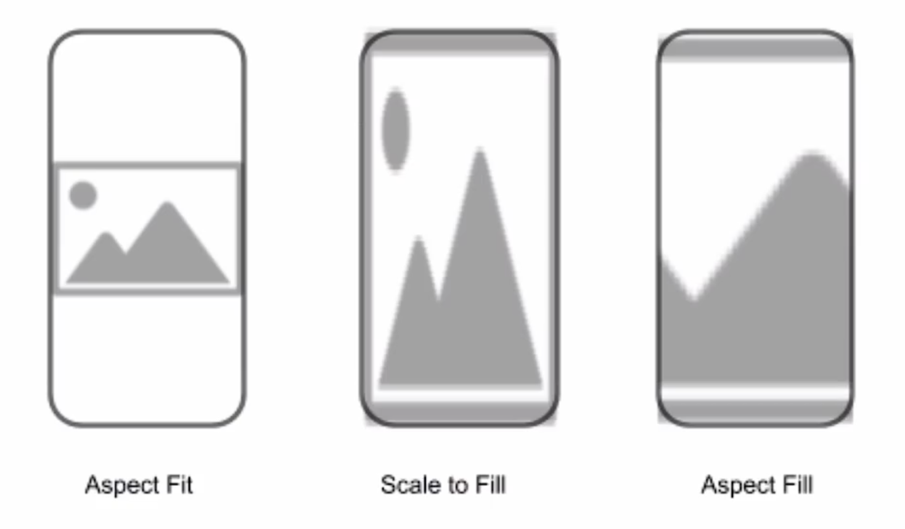

# 看到P14
# 1、开始

- ios，app
- interface 模版选择 Storyboard 入手

- view contorller scence 类似图层的概念
- lanuchScreen是app启动时展示的和Main不同
- 在assests文件夹下导入app的Icon：1x，2x，3x
- appicon.co网站可以生成所有app图标，通知等等不同尺寸的图标
- canva.com帮你生成app Icon

## 2、手机预览开发项目
- setting里的accounts登录appleid
- 点击项目根目录
- singing * capabilities： 开启Automatically manage signing
- 选择team为自己
- 想让ImageView自适应宽高应该怎么做？
  - content Mode为Scale To Fill
  - 

## 3、如何联系Main中的图像与ViewController里面的代码？
- option + 鼠标 拖动至代码处