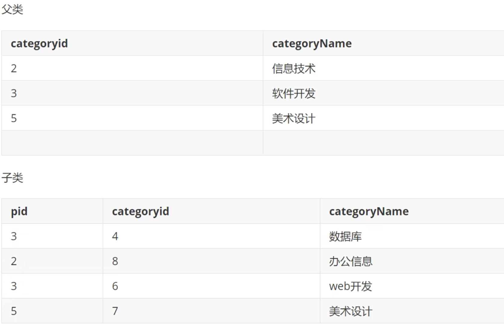

## 1、数据库

- 关系型 SQL
  - 通过表和表之间，行和列之间的关系进行存储
  - Mysql，Oracle，SqlServer，DB2，SQLlite
- 非关系型 Not only SQL
  - 对象存储，通过对象的属性来决定
  - redis，MongDB
- DBMS：数据库管理系统
- mysql：5.7 稳，8.0 新

## 2、连接数据库

```shell
mysql -u root -p12345678
//12345678是你的密码
```

## 3、命令

```shell
flush privileges --刷新权限
- 切换数据库
use xxxdatabase;
- 查看所有数据库
show databases;
- 创建数据库
create database xxx;
- 看表
show tables
-
```

## 4、操作数据库

- 列类型

```md
INT：存储整数

VARCHAR(100): 存储变长字符串，可以指定长度

CHAR：定长字符串，不够的自动在末尾填充空格

DOUBLE：存储浮点数

DATE：存储日期 2023-05-27

TIME：存储时间 10:13

DATETIME：存储日期和时间 2023-05-27 10:13
```

- 操作数据库

```sql
CREATE DATABASE IF NOT EXISTS mydatabase
DROP DATABASE IF EXISTS mydatabase
```

- 操作数据库中的表

```sql
USE `mydatabase`
SHOW DATABASE `mydatabase`
```

- 操作数据库中的表中的数据

## 5、数据库中数据类型

- 数值
  - tinyint 1 字节
  - smallint 2 字节
  - int 4 字节(常用)
  - mediumint 3 字节
  - bigint 8 字节
  - float 4 字节
  - double 8 字节
  - decimal 字符串形式的浮点数(金融计算的时候)
- 字符串
  - char 字符串固定大小的 0-255
  - varchar 可变字符串 0-65535(常用)
  - tinytext 微型文本 2^8-1
  - text 文本串 大型文本 2^16-1
- 时间日期
  - data:YYYY-MM-DD
  - time:HH:mm:ss
  - datetime:YYYY-MM-DD HH:mm:ss(常用)
  - timestamp：时间戳(常用)
  - year：年份
- null
  - 没有值，位置
  - 注意不要使用 NULL 进行运算，结果为 NUll

## 6、数据库的字段属性

- Unsigned
  - 无符号整数
  - 不能声明为负数
- zerofill
  - 0 填充
  - 不足的位数使用 0 来填充，int(3),5,005
- auto increament 自增：通常用来设计唯一主键，必须是整数类型
- null/not null：是否必填

## 7、创建数据库表

```sql
CREATE TABLE IF NOT EXISTS `student` (
  -- '字段名' 列类型 [属性] [索引] [注释],
 `id` INT(4) NOT NULL AUTO_INCREMENT  COMMENT '学号',
 `name` VARCHAR(20) NOT NULL DEFAULT('狂野之裤')  COMMENT '姓名',
 `pwd` VARCHAR(20) NOT NULL DEFAULT('123456')  COMMENT '密码',
 `sex` VARCHAR(2) NOT NULL DEFAULT('男')  COMMENT '密码',
 `birthday` DATETIME DEFAULT  NULL COMMENT '生日',
 `address` VARCHAR(100) DEFAULT  NULL COMMENT '家庭住址',
 `email` VARCHAR(100) DEFAULT  NULL COMMENT '邮箱',
 PRIMARY KEY(id)
)ENGINE=INNODB DEFAULT CHARSET=utf8
-- [表类型][字符集设置][注释]
```

- 查看创建数据库的定义语句

```sql
SHOW CREATE DATABASE school -- 查看创建学生表的定义语句
```

- 查看创建数据表的定义语句

```sql
SHOW CREATE TABLE student -- 查看创建学生表的定义语句
```

- 显示表的结构

```sql
DESC student -- 显示表的结构
```

## 8、MyISAM 和 InnoDB 的区别

- ENGINE=MYISAM //早些年使用的
- ENGINE=INNODB //默认使用的

- 事务支持
  - MYISAM 不支持
  - INNODB 支持
- 数据行锁定
  - MYISAM 不支持
  - INNODB 支持
- 外键约束
  - MYISAM 不支持
  - INNODB 支持
- 全文索引
  - MYISAM 支持
  - INNODB 不支持
- 表空间大小
  - MYISAM 较小
  - INNODB 约等于前者的 2 倍

## 9、修改和删除数据库表

- 修改表

```sql
ALERT TABLE teacher RENAME AS teacher1
```

- 赠加表字段(列属性)

```sql
ALERT TABLE teacher ADD age INT(11)
```

- 修改表字段(重命名，修改约束)

```sql
ALERT TABLE teacher MODIFY age INT(11) -- 重命名
ALERT TABLE teacher CHANGE age age1 INT(11) -- 修改约束
```

- 删除表字段

```sql
ALERT TABLE teacher DROP ag1 -- 重命名
```

- 删除尽量加上 EXISTS 判断

## 10、数据管理

#### 10.1、外键

- a 表中 x 字段称为 b 表中 y 字段的约束
- 有外键的表删除不掉
- 创建表的时候没有外键，如何增加

```sql
ALTER TABLE `student`
ADD CONSTRAINT `FK_gradeid` FOREIGN KEY (`作为外键的列`) REFERENCES `哪个表` (`哪个字段`);
```

- 以上操作都是物理外键，数据库级别的外键，不建议使用
- `最佳实践`
  - 数据库就是单纯的表，只用来存数据，只有行列
  - 想要使用多张表的数据，想使用外键(程序实现)

#### 10.2、DML 语言

- insert
- update
- delete

#### 10.3、增

```sql
-- 主键自增可以省略主键
-- 不写字段会一一匹配
INSERT INTO `grade`(gradname) values('大四')
INSERT INTO `grade`(gradeId,gradeName) values('1','大二'),('xx','xx')
```

#### 10.4、删

- delete

```sql
DELETE FROM `student` where id = 1
```

- TRUNCATE 命令：完全清空一个表,表的结构和索引约束不会改变

```sql
TRUNCATE `student`
```

- 相同点，都能删除数据
- 不同点
  - TURNCATE 重新设置自增列，计数器会归零
  - TURNCATE 不会影响事务

#### 10.5、改

- update

```sql
-- update
UPDATE `grade` set `gradename`='Youngzx' WHERE gradeid = 1
-- 多个属性用逗号隔开
UPDATE `grade` set `gradename`='Youngzx',`email`='1216238955@qq.com' WHERE gradeid = 1
```

- BETWEEN 2 AND 5 ->在 2 到 5 之间
- AND &&
- OR ||

#### 10.6、查

```sql
-- 查询全部
SELECT * FROM student
-- 查询某列(起别名)
SELECT `phone` AS '手机号',`address` AS '地址' from student
-- 函数Concat
SELECT CONCAT('姓名:',StudentName) AS 新名字 FROM student
-- 去重 distinct
SELECT DISTINCT subjectno from result;//去除重复的subjectno
-- where 条件子句
SELECT `studentNo`,`StudentResult` from result
WHERE StudentResult >=20 AND StudentResult <=100
-- 模糊查询Like，%代表0到任意一个字符，_后面只有一个字
SELECT `studentNo`,`studentname` from student
WHERE studentname LIKE '%强'
-- 模糊查询in(查询1001，1002，1003号学员),in是一个具体的值
SELECT `studentNo`,`studentname` from student
WHERE StudentNo IN ('1001','1002','1003')
-- 连表查询
-- 因为两个表都有studentNo，所以需要定义查询出来的是哪个表的
-- innerJoin（join on连接查询，where条件查询）
SELECT s.studentNo,studentName,SubjectNo,StudentResult
FROM student AS s
INNER JOIN result AS r
WHERE s.studentNo = r.studentNo/ON s.studentNo = r.studentNo
-- rightJoin:从右表中查询所有的值，即使左表没有匹配的值
-- leftJoin:从左表中查询所有的值，即使右表没有匹配的值
```

## 11、自连接

- 自己的表和自己的表连接
- 核心：一张表拆为 2 张
  

```sql
SELECT a.categoryname as 父,b.categoryname as 子
FROM category as a,category as b
WHERE a.categoryid = b.pid;
```

## 12、分页和排序

- orderBy(排序)

```sql
ORDER BY 某个字段 ASC -- 升序
ORDER BY 某个字段 DESC -- 降序
```

- limit(分页)

```sql
-- index size
-- (n-1) * pageSize
LIMIT 0,5 -- 第一开始加载五条数据
```

## 13、子查询和嵌套查询

- 在 where 语句中嵌套一个子查询语句

```sql
where (select * from ...)
```

## 14、mysql 常用函数

## 15、聚合函数以及分组过滤

- COUNT()：COUNT(\*),COUNT(1)几乎相等
- SUM()
- AVG()
- MAX()
- MIN()
- 分组

- where 不能接聚合函数，groupby 以后要用 HAVING 去过滤

```sql
GROUP BY 表名.字段
HAVING xxx > 80
```

## 16、拓展 MD5

- MD5 加密
- 不可逆
- MD5()

## 17、事务 ACID 原则

- 事务
  - 要么都成功,要么都失败
- 一组 sql 放在一个批次中去执行
- ACID 原则
  - 原子性
  - 一致性
  - 隔离性
  - 持久性

## 18、测试事务实现转账

- mysql 是默认开始事务自动提交的

```sql
SET autocommit = 0; -- 关闭
```

```sql
START TRANSACTION -- 标记一个事物的开启
INSERT xxx
INSERT xxx
COMMIT -- 提交，一旦提交就被持久化了
ROLLBACK -- 回滚
SAVEPOINT 保存点名 -- 设置一个事物的保存点
BACK TO SAVEPOINT 保存点名 -- 回滚到保存点
RELEASE SAVEPOINT <保存点名> -- 撤销指定的保存点
```

## 19、索引介绍及索引分类

- 主键索引
  - 唯一的标识，主键不可重复，只能有一个列作为主键
- 唯一索引
  - 避免重复的列出现，唯一索引可以重复，多个列都可以标识为唯一索引
- 常规索引
  - 默认的，index，key 关键字来设置
- 全文索引

  - 特定的数据库下才有，快速定位数据

- 索引的使用

  - 在创建表的时候给字段增加索引
  - 创建完毕后，增加索引

- 显示所有索引信息

```sql
SHOW INDEX FROM student
```

- 增加索引 (索引名)列名

```sql
ALTER TABLE `student` ADD FULLTEXT INDEX `studentName` (studentName)
```

- EXPLAIN 去分析查找语句
- 时间长？添加索引

```sql
-- CREATE INDEX 索引名字 ON 表(字段)
CREATE INDEX id_app_user_name ON app_user(`name`)
```

## 20、索引原则

- 索引不是越多越好，后面查询再加
- 不要对经常变化的数据加索引
- 小数据量的表不需要加索引
- 索引一般加在常用查询的字段上

## 21、数据库用户管理

- 本质还是对 mysql.user 这张表进行增删改查

## 22、数据库备份

- 直接拷贝物理文件
- 可视化工具导出

## 23、如何设计数据库

- 减少冗余，减少数据耦合

## 24、三大范式

- 为什么需要数据规范化？

  - 信息重复
  - 更新异常
  - 插入异常
  - 删除异常

- 第一范式：每一列都是不可再分割的
- 第二范式：满足第一范式的前提下，每张表只描述一件事，每张表的每一列都要和逐渐相关，而不能只与主键某一部分相关
- 第三范式：满足前两个的前提下，确保每一列的数据都和主键直接相关，而不是间接相关
- 规范数据库，但是不一定要完完全全按照这个
- 性能和规范不可兼得，考虑商业化的需求和目标，关联查询不要超过 3 个表

## 25、使用 docker 启动 mysql 服务

- 创建一个 mysql Image
- port：3306；挂载 volums：本地的/User/youngzx/mysql 挂载到 container 的/var/lib/mysql 上；environment variables：MYSQL_ROOT_PASSWORD:youngzx
- 或者通过 docker run 加载密码：`docker run --name mysql_container -e MYSQL_ROOT_PASSWORD=your_password -d mysql`

## 26、常用 mysql 命令

```md
where：查询条件，比如 where id=1
as：别名，比如 select xxx as 'yyy'
and: 连接多个条件
in/not in：集合查找，比如 where a in (1,2)
between and：区间查找，比如 where a between 1 and 10
limit：分页，比如 limit 0,5
order by：排序，可以指定先根据什么升序、如果相等再根据什么降序，比如 order by a desc,b asc
group by：分组，比如 group by aaa
having：分组之后再过滤，比如 group by aaa having xxx > 5
distinct：去重
sql 还可以用很多内置函数：

聚合函数：avg、count、sum、min、max
字符串函数：concat、substr、length、upper、lower
数值函数：round、ceil、floor、abs、mod
日期函数：year、month、day、date、time
条件函数：if、case
系统函数：version、datebase、user
类型转换函数：convert、cast、date_format、str_to_date
其他函数：nullif、coalesce、greatest、least
```

## 27、join 的区别

- JOIN ON 默认是 INNER JOIN ON：INNER JOIN 是只返回两个表中能关联上的数据。
- LEFT JOIN 是额外返回左表中没有关联上的数据。
- RIGHT JOIN 是额外返回右表中没有关联上的数据。

## 28、外键的更新方式

- CASCADE： 主表主键更新，从表关联记录的外键跟着更新，主表记录删除，从表关联记录删除

- SET NULL：主表主键更新或者主表记录删除，从表关联记录的外键设置为 null

- RESTRICT：只有没有从表的关联记录时，才允许删除主表记录或者更新主表记录的主键 id

- NO ACTION： 同 RESTRICT，只是 sql 标准里分了 4 种，但 mysql 里 NO ACTION 等同于 RESTRICT。

- 但是实际场景应该尽量避免使用外键

## 29、一对多，多对多

- 一对多主要是通过外键来建立关联关系
- 多对多通常是通过中间表来进行映射
  - 例如`article`表的 id，是`article_tag`表中 article_id 的外键
  - 同时`tag`表的 id，也是`article_tag`表中 tag_id 的外键
  - 这样 article 表和 tag 表通过 article_tag 表建立关联关系
  - 记得中间表的链接方式一定要用 CASCADE，不然删除主表记录时，中间表记录不会跟着删除

## 30、node 如何连接数据库？

### 30.1、mysql2

- mysql2

```js
const mysql = require('mysql2')

const connection = mysql.createConnection({
  host: 'localhost',
  user: 'root',
  password: '12345678',
  database: 'nest-demo',
})

connection.query(
  'SELECT * FROM employee WHERE name LIKE ?',
  ['李%'],
  function (err, results, fields) {
    console.log(results)
    console.log(fields.map((item) => item.name))
  }
)
// promise 版本
const mysql = require('mysql2/promise')

;(async function () {
  const connection = await mysql.createConnection({
    host: 'localhost',
    port: 3306,
    user: 'root',
    password: 'guang',
    database: 'nest-demo',
  })

  const [results, fields] = await connection.query('SELECT * FROM customers')

  console.log(results)
  console.log(fields.map((item) => item.name))
})()
```

- 连接池
  - 因为数据库的连接建立还是很耗时的，而且一个连接也不够用。

```js
const mysql = require('mysql2/promise')

;(async function () {
  const pool = mysql.createPool({
    host: 'localhost',
    user: 'root',
    password: 'guang',
    database: 'practice',
    waitForConnections: true,
    connectionLimit: 10,
    maxIdle: 10,
    idleTimeout: 60000,
    queueLimit: 0,
    enableKeepAlive: true,
    keepAliveInitialDelay: 0,
  })

  const [results] = await pool.query('select * from customers')
  console.log(results)
})()
```

### 30.2、typeORM

- npx typeorm@latest init --name typeorm-mysql-test --database mysql
- npm run start
- 常用的命令，具体的 EntityManager 和 Repository 的方法有这些：

  - save：新增或者修改 Entity，如果传入了 id 会先 select 再决定修改还新增
  - update：直接修改 Entity，不会先 select
  - insert：直接插入 Entity
  - delete：删除 Entity，通过 id
  - remove：删除 Entity，通过对象
  - find：查找多条记录，可以指定 where、order by 等条件
  - findBy：查找多条记录，第二个参数直接指定 where 条件，更简便一点
  - findAndCount：查找多条记录，并返回总数量
  - findByAndCount：根据条件查找多条记录，并返回总数量
  - findOne：查找单条记录，可以指定 where、order by 等条件
  - findOneBy：查找单条记录，第二个参数直接指定 where 条件，更简便一点
  - findOneOrFail：查找失败会抛 EntityNotFoundError 的异常
  - query：直接执行 sql 语句
  - createQueryBuilder：创建复杂 sql 语句，比如 join 多个 Entity 的查询
  - transaction：包裹一层事务的 sql
  - getRepository：拿到对单个 Entity 操作的类，方法同 EntityManager

  ```ts
  AppDataSource.initialize().then(async () => {
    const user = new User()
    user.id = 1
    user.firstName = 'aaa111'
    user.lastName = 'bbb'
    user.age = 25
    await AppDataSource.manager.save(user)

    await AppDataSource.manager.save(User, [
      { firstName: 'ccc', lastName: 'ccc', age: 21 },
      { firstName: 'ddd', lastName: 'ddd', age: 22 },
      { firstName: 'eee', lastName: 'eee', age: 23 },
    ])
    await AppDataSource.manager.save(User, [
      { id: 2, firstName: 'ccc111', lastName: 'ccc', age: 21 },
      { id: 3, firstName: 'ddd222', lastName: 'ddd', age: 22 },
      { id: 4, firstName: 'eee333', lastName: 'eee', age: 23 },
    ])

    await AppDataSource.manager.delete(User, 1)
    await AppDataSource.manager.delete(User, [2, 3])

    const users = await AppDataSource.manager.find(User)
    console.log(users)

    const users = await AppDataSource.manager.findBy(User, {
      age: 23,
    })
    console.log(users)

    const [users, count] = await AppDataSource.manager.findAndCount(User)
    console.log(users, count)

    const [users, count] = await AppDataSource.manager.findAndCountBy(User, {
      age: 23,
    })
    console.log(users, count)

    const user = await await AppDataSource.manager.findOne(User, {
      select: {
        firstName: true,
        age: true,
      },
      where: {
        id: 4,
      },
      order: {
        age: 'ASC',
      },
    })
    console.log(user)

    const users = await await AppDataSource.manager.find(User, {
      select: {
        firstName: true,
        age: true,
      },
      where: {
        id: In([4, 8]),
      },
      order: {
        age: 'ASC',
      },
    })
    console.log(users)

    const user = await AppDataSource.manager.findOneBy(User, {
      age: 23,
    })
    console.log(user)

    try {
      const user = await AppDataSource.manager.findOneOrFail(User, {
        where: {
          id: 666,
        },
      })
      console.log(user)
    } catch (e) {
      console.log(e)
      console.log('没找到该用户')
    }

    const users = await AppDataSource.manager.query(
      'select * from user where age in(?, ?)',
      [21, 22]
    )
    console.log(users)

    const queryBuilder = await AppDataSource.manager.createQueryBuilder()
    const user = await queryBuilder
      .select('user')
      .from(User, 'user')
      .where('user.age = :age', { age: 21 })
      .getOne()

    console.log(user)

    const queryBuilder = await AppDataSource.manager.createQueryBuilder()
    const query = queryBuilder
      .select('user.name', 'name')
      .addSelect('COUNT(post.id)', 'count')
      .from(User, 'user')
      .leftJoin(Post, 'post', 'post.userId = user.id')
      .where('user.id = :id')
      .andWhere('post.isActive = :isActive')
      .setParameters({ id: 1, isActive: true })
      .groupBy('user.name')
      .having('COUNT(post.id) > :postCount', { postCount: 2 })

    const results = await query.getRawMany()

    await AppDataSource.manager.transaction(async (manager) => {
      await manager.save(User, {
        id: 4,
        firstName: 'eee',
        lastName: 'eee',
        age: 20,
      })
    })
  })
  ```

### 30.3、typeorm 1 对 1 映射关系/CRUD

- `npx init typeorm@latest --name xxx --database mysql`
- `pnpm i mysql2`
- 配置 dataSource

  ```ts
    connectorPackage: 'mysql2',
    extra: {
        authPlugin: 'sha256_password',
    }
  ```

- 创建表:通过 typeorm entity:create 命令创建`npx typeorm entity:create src/entity/IdCard`

- 设置连接，默认外键为主键，查看效果

  ```ts
  @JoinColumn()
  @OneToOne(() => User)
  user: User
  // 或者指定外键列
  // @JoinColumn({name: "userId"})
  // CASCADE
  //
  @OneToOne(() => User,{
    //这个 cascade 不是数据库的那个级联，而是告诉 typeorm 当你增删改一个 Entity 的时候，是否级联增删改它关联的 Entity。
    cascade: true,
    onDelete: 'CASCADE',
    onUpdate: 'CASCADE'
  })
  // 查找出相关的数据
    const ics = await AppDataSource.manager.find(IdCard,{
    relations:{
      user: true
    }
    });
    console.log(ics);
  //[
  // IdCard {
  //  id: 1,
  //  cardName: '1',
  //  user: User { id: 1, firstName: 'Young', lastName: 'zx', age: 20 }
  //  }
  //]
  // 或者用query builder 的方式来查询
  const ics = await AppDataSource.manager.getRepository(IdCard)
    .createQueryBuilder("ic")
    .leftJoinAndSelect("ic.user", "u")
    .getMany();

  console.log(ics);
  ```

### 30.4、typeorm 1 对 多 映射关系/CRUD

- 通过 @ManyToOne 或者 @OneToMany 装饰器。
- TypeORM 会自动在多的那一方添加外键，不需要通过 @JoinColumn 指定，不过你可以通过 @JoinColumn 来修改外键列的名字。
- 双方只能有一方 cascade，不然会无限循环。设置了 cascade 之后，只要一方保存，关联的另一方就会自动保存。
- 删除的话，如果设置了外键的 CASCADE 或者 SET NULL，那只删除主表（一的那一方）对应的 Entity 就好了，msyql 会做后续的关联删除或者 id 置空。否则就要先删除所有的从表（多的那一方）对应的 Entity 再删除主表对应的 Entity。

  ```ts
  @Entity()
  export class Department {
    @PrimaryGeneratedColumn()
    id: number

    @Column({
      length: 50,
    })
    name: string

    // 因为一对多关系中，一个实体可以关联到多个其他实体，而一个实体只能关联到一个其他实体。
    // 假设有两个实体：Department（部门）和Employee（员工）。一个部门可以有多个员工，而一个员工只属于一个部门。
    // 由于一个员工只属于一个部门，所以将外键保存在Employee实体中更合适。在Employee实体中，使用@ManyToOne装饰器指定了与Department实体的多对一关系，并使用department属性来表示关联。这样，Employee实体会自动创建一个外键列（例如"department_id"），用于关联到Department实体的id主键。
    @OneToMany(
      () => Employee,
      (employee) => {
        employee.department
      }
    )
    employee: Employee[]
  }

  @Entity()
  export class Employee {
    @PrimaryGeneratedColumn()
    id: number

    @Column({
      length: 50,
    })
    name: string

    @ManyToOne(() => Department, {
      onDelete: 'CASCADE',
      onUpdate: 'CASCADE',
    })
    department: Department
  }

  // 1. 1对多
  // const d1 = new Department();
  // d1.name = '技术部';

  // const e1 = new Employee();
  // e1.name = '张三';
  // e1.department = d1;

  // const d2 = new Department();
  // d2.name = '设备部';

  // await AppDataSource.manager.save(Department,d2)

  // const e2 = new Employee();
  // e2.name = '李四';
  // e2.department = d1;

  // const e3 = new Employee();
  // e3.name = '王五';
  // e3.department = d1;

  // const e4 = new Employee();
  // e4.name = '赵五';
  // e4.department = d2;

  // await AppDataSource.manager.save(Department, d2);
  // await AppDataSource.manager.save(Employee,e4);

  // 2. 级联查询
  // const deps = await AppDataSource.manager.createQueryBuilder()
  // .select("emp")
  // .from(Employee,"emp")
  // .leftJoinAndSelect("emp.department","epmDid")
  // .where("emp.departmentId = :id",{id:2})
  // .getMany()
  // console.log(deps)

  // 3. 删除某一个主表行，关联的从表也会被设置为null（或者同步删除）
  // await AppDataSource.manager.createQueryBuilder()
  // .delete()
  // .from(Employee)
  // .where("departmentId = :id", { id: 2 })
  // .execute();

  await AppDataSource.manager
    .createQueryBuilder()
    .delete()
    .from(Department)
    .where('id = :id', { id: 1 })
    .execute()
  ```

### 30.5、多对多映射

- 一对一我们是通过 @OneToOne 和 @JoinColumn 来把 Entity 映射成数据库表
- 一对多我们是通过 @OneToMany 和 @ManyToOne 来把 Entity 映射成数据库表，它并不需要 @JoinColumn 来指定外键列，因为外键一定在多的那一边。
- 前面讲过，在数据库里，我们是通过中间表来保存这种多对多的关系的：把多对多拆成了两个一对多

  ```ts
  // 1. 创建多对多映射，只需要一边写就好了
  @JoinTable()//自动创建中间表
  @ManyToMany(()=>Tag)//与哪个表映射多对多关系
  tags: Tag[]
  // 2. 修改
  const article = await entityManager.createQueryBuilder(Article, "article")
  .leftJoinAndSelect("article.tags", "tag")
  .where("article.id = :id", { id: 2 })
  .getOne();
  if (article) {
    article.title = "ccccc";
    article.tags = article.tags.filter(item => item.name.includes('ttt111'));
    await entityManager.save(article);
  }
  // await entityManager.delete(Article, 1);
  // await entityManager.delete(Tag, 1);

  // 3. 如果 tag 里也想有文章的引用呢？
  // 那就加一个 @ManyToMany 的映射属性。只不过它还需要第二个参数指定外键列在哪里。而且不止这里要加，article 里也要加
  // 因为如果当前 Entity 对应的表是包含外键的，那它自然就知道怎么找到关联的 Entity。但如果当前 Entity 是不包含外键的那一方，怎么找到对方呢？这时候就需要手动指定通过哪个外键列来找当前 Entity 了。之前 OneToOne、OnToMany 都是这样：比如一对一的 user 那方，不维护外键，所以需要第二个参数来指定通过哪个外键找到 user。而多对多的时候，双方都不维护外键，所以都需要第二个参数来指定外键列在哪里，怎么找到当前 Entity。

  // 4. 多对多关系的修改只要查出来之后修改下属性，然后 save，TypeORM 会自动去更新中间表。
  ```
