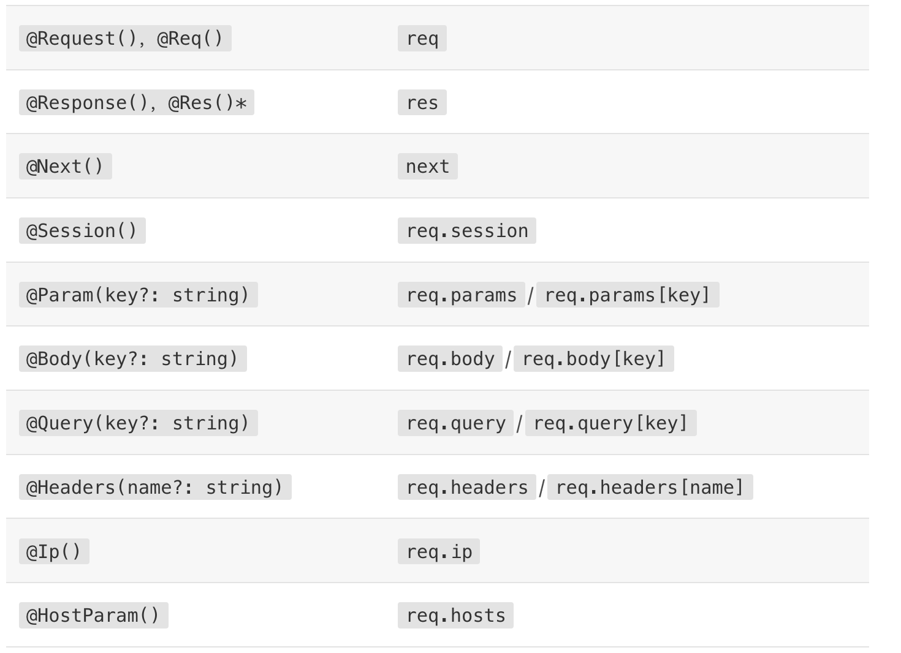

# 1.新建项目

- nest new project-name
- npm run start:dev
- 访问`http://localhost:3000/`
- nest g controller cat
- nest g service cat
- nest generate resource cats (快速创建一个CRUD)

# 2.控制器

## 2.1、路由

- 控制器负责处理`传入的请求`和`客户端返回响应`
- 目的是接受应用的特定丘顶，路由机制控制哪个控制器接收哪些请求。
- 通常，每个控制器有多个路由，不同的路由可以执行不同的操作。
- 为了创建一个基本的控制器，我们使用`类`和`装饰器`。装饰器将`类`与所需的`元数据`相关联，并使 Nest 能够创建路由映射（将请求绑定到相应的控制器）。
- 手动建立一个`xxx.controller.ts`或者用 cli 创建，只需执行 `nest g controller cats` 命令。

```ts
// 该路径包括可选的控制由路径前缀和请求方法装饰器(get/post...)中声明的任何路径字符串。
// 例如，路径前缀 customers 与装饰器 @Get('profile') 组合会为 GET /customers/profile 请求生成路由映射。
import { Controller, Get } from '@nestjs/common'

@Controller('cats')
export class CatsController {
  @Get()
  findAll(): string {
    return 'This action returns all cats'
  }
}
```

- 此函数将返回 200 状态代码和相关的响应，在本例中只返回了一个字符串。
  - 标准（推荐）：使用这个内置方法，当请求处理程序返回一个 JavaScript 对象或数组时，它将自动序列化为 JSON。但是，当它返回一个 JavaScript 基本类型（例如 string、number、boolean）时， Nest 将只发送值，而不尝试序列化它。这使响应处理变得简单：只需要返回值，其余的由 Nest 负责。
  - 类库特有的：我们可以在函数签名处通过 @Res() 注入类库特定的响应对象（例如， Express）。使用此方法，你就能使用由该响应对象暴露的原生响应处理函数。例如，使用 Express，您可以使用 response.status(200).send() 构建响应

## 2.2、Request

- 处理程序有时需要访问客户端的请求细节。Nest 提供了对底层平台（默认为 Express）的请求对象（request）的访问方式。我们可以在处理函数的签名中使用 @Req() 装饰器，指示 Nest 将请求对象注入处理程序。

```ts
 findAll(@Req() request: Request): string {
    return 'This action returns all cats';
  }
```

- 为了在 express 中使用 Typescript （如 request: Request 上面的参数示例所示），请安装 @types/express 。
- Request 对象代表 `HTTP 请求`，并具有查询字符串，`请求参数`参数，`HTTP 标头（HTTP header）` 和 `正文（HTTP body）`的属性（在这里阅读更多）。在多数情况下，不必手动获取它们。 我们可以使用专用的装饰器，比如开箱即用的 `@Body()` 或 `@Query()` 。 下面是 Nest 提供的装饰器及其代表的底层平台特定对象的对照列表。
- 

## 2.3、资源

- @Get()
- @Post()
- Nest 为所有标准的 HTTP 方法提供了相应的装饰器：@Put()、@Delete()、@Patch()、@Options()、以及 @Head()。此外，@All() 则用于定义一个用于处理所有 HTTP 请求方法的处理程序。

## 2.4、路由通配符

- @Get('ab*cd')

## 2.5、状态码

- 如上所述，默认情况下，响应的状态码总是默认为 200，除了 POST 请求（默认响应状态码为 201），我们可以通过在处理函数外添加 @HttpCode（...） 装饰器来轻松更改此行为。

```ts
//HttpCode 需要从 @nestjs/common 包导入。
@Post()
@HttpCode(204)
create() {
  return 'This action adds a new cat';
}
```

## 2.6、Headers

- 要指定自定义响应头，可以使用 @header() 装饰器或类库特有的响应对象，（并直接调用 res.header()）。
- Header 需要从 @nestjs/common 包导入。

## 2.7、重定向

- @Redirect() 装饰器有两个可选参数，url 和 statusCode。 如果省略，则 statusCode 默认为 302。
- @Get()
- @Redirect('<https://nestjs.com>', 301)

## 2.8、路由参数

- 当您需要接受动态数据（dynamic data）作为请求的一部分时（例如，使用GET /cats/1 来获取 id 为 1 的 cat），带有静态路径的路由将无法工作。为了定义带参数的路由，我们可以在路由路径中添加路由参数标记（token）以捕获请求 URL 中该位置的动态值。下面的 @Get() 装饰器示例中的路由参数标记（route parameter token）演示了此用法。以这种方式声明的路由参数可以使用 @Param() 装饰器访问，该装饰器应添加到函数签名中。

```ts
@Get(':id')
findOne(@Param() params): string {
  console.log(params.id);
  return `This action returns a #${params.id} cat`;
}
```

## 2.9、子域路由

- @Controller 装饰器可以接受一个 host 选项，以要求传入请求的 HTTP 主机匹配某个特定值。
- 用到的时候再查文档吧

## 2.10、作用域

- 可能对 Nest 中几乎所有内容都可以在传入的请求之间共享感到非常意外。例如，我们有一个数据库连接池，具有全局状态的单例服务等。请记住，Node.js 并不遵循请求/响应多线程无状态模型（在该模型中，每个请求都由单独的线程处理），在 Nest 中，每个请求都由主线程处理。因此，使用单例实例对我们的应用程序来说是完全安全的。

## 2.11、异步性

- 我们酷爱现代 Javascript，并且我们知道数据读取（data extraction）大多是异步的.这就是为什么 Nest 完美支持异步函数（Async Function）特性的原因。
- 每个异步函数都必须返回一个 Promise。这意味着您可以返回延迟值，而 Nest 将自行解析它。让我们看看下面这个例子

```ts
@Get()
async findAll(): Promise<any[]> {
  return [];
}
```

- 此外，通过返回 RxJS observable 流，Nest 路由处理程序将更加强大。 Nest 将自动订阅下面的源并获取最后发出的值（在流完成后）。

```ts
@Get()
findAll(): Observable<any[]> {
  return of([]);
}
```

## 2.12、请求负载

- 此前我们列举的的 POST 路由处理程序样例中，处理程序没有接受任何客户端参数。我们在这里通过添加 @Body() 参数来解决这个问题。

- 创建 CreateCatDto 类

```ts
/*
  create-cat.dto.ts
*/
export class CreateCatDto {
  readonly name: string;
  readonly age: number;
  readonly breed: string;
}
```

```ts
// cats.controller.ts
@Post()
async create(@Body() createCatDto: CreateCatDto) {
  return 'This action adds a new cat';
}
```

## 2.13、处理错误

- 略

## 2.14、有关控制器的完整例子

```ts
import { Controller, Get, Query, Post, Body, Put, Param, Delete } from '@nestjs/common';
import { CreateCatDto, UpdateCatDto, ListAllEntities } from './dto';

@Controller('cats')
export class CatsController {
  @Post()
  create(@Body() createCatDto: CreateCatDto) {
    return 'This action adds a new cat';
  }

  @Get()
  findAll(@Query() query: ListAllEntities) {
    return `This action returns all cats (limit: ${query.limit} items)`;
  }

  @Get(':id')
  findOne(@Param('id') id: string) {
    return `This action returns a #${id} cat`;
  }

  @Put(':id')
  update(@Param('id') id: string, @Body() updateCatDto: UpdateCatDto) {
    return `This action updates a #${id} cat`;
  }

  @Delete(':id')
  remove(@Param('id') id: string) {
    return `This action removes a #${id} cat`;
  }
}
```

## 2.15、最后一步

- 在 @Module() 装饰器中包含 controllers 数组的原因。 由于除了根模块 AppModule之外，我们还没有定义其他模块

## 2.16、例子

- 一个有参数的get请求

```ts
// 这里没有service，正常的流程应该是controller调用service里的函数
// service则是实现使用Typeorm或者Mongoose去实现操作数据库
import { Controller, Get, Post, Query, Req } from '@nestjs/common';
import { query } from 'express';
import { updateCatDto } from './dto/updateCatDto';
@Controller('cats')
export class CatsController {
  private readonly catName = 'Tom'; // 假设猫的名字为'Tom'
  @Get('getCats')
  getByCatsId(@Query('id') id: string): string {
    if (id === this.catName) {
      return `The id is equal to the cat's name.`;
    } else {
      return `The id is not equal to the cat's name.`;
    }
    return ;
  }
}
//扩展
// cat.service.ts
// 在这个例子中，查询数据库的操作是通过this.catsRepository.findOne(id)这行代码实现的。catsRepository是TypeORM的Repository对象，findOne(id)是它的一个方法，用于从数据库中查找一个具有特定id的记录。
// findOne(id)方法会向数据库发送一个SQL查询，例如SELECT * FROM cats WHERE id = ?（假设cats是你的表名），并将查询结果返回。这个查询是异步进行的，因此我们需要使用await关键字等待它完成。
// findOne是TypeORM库提供的方法，它已经封装了对数据库的查询操作。你只需要提供一个id作为参数，findOne方法就会在数据库中查找具有这个id的记录。
// TypeORM库提供了许多类似的方法，用于进行各种数据库操作，例如find、save、remove等。这些方法都已经封装了对应的SQL查询，你只需要提供相应的参数，就可以进行增删改查操作。
// 当然，如果你需要进行更复杂的查询，例如联表查询、条件查询等，TypeORM也提供了QueryBuilder接口，你可以使用它来手动构建SQL查询。

import { Injectable } from '@nestjs/common';
import { InjectRepository } from '@nestjs/typeorm';
import { Repository } from 'typeorm';
import { Cat } from './cat.entity';

@Injectable()
export class CatService {
  constructor(
    @InjectRepository(Cat)
    private catsRepository: Repository<Cat>,
  ) {}

  async findCatById(id: string): Promise<Cat> {
    return await this.catsRepository.findOne(id);
  }
}

// cat.controller.ts
import { Controller, Get, Query } from '@nestjs/common';
import { CatService } from './cat.service';

@Controller('cats')
export class CatsController {
  constructor(private catService: CatService) {}

  @Get('getByCatsId')
  async getByCatsId(@Query('id') id: string): Promise<string> {
    const cat = await this.catService.findCatById(id);

    if (cat && cat.name === id) {
      return `The id is equal to the cat's name.`;
    } else {
      return `The id is not equal to the cat's name.`;
    }
  }
}


```

# 3.providers

- 我们已经创建了一个简单的控制器 CatsController 。
- 控制器应处理 HTTP 请求并将更复杂的任务委托给 providers。
- Providers 是纯粹的 JavaScript 类，在其类声明之前带有 @Injectable()装饰器。

## 3.1、service

- 从创建一个简单的 CatsService 开始。该服务将负责数据存储和检索，其由 CatsController 使用，因此把它定义为 provider，是一个很好的选择。
- 因此，我们用 @Injectable() 来装饰这个类 。- 在NestJS中，Provider是一个可以被注入到其他类中的类、值或者工厂。也就是说，如果你希望一个类、值或者工厂可以在其他地方被使用，你需要将它定义为Provider。

  ```ts
  // 首先要注册Module
  @Module({
    imports: [],
    controllers: [AppController, CatsController],
    providers: [AppService, CatsService],
  })
  
  // cats.service.ts

  import { Injectable } from '@nestjs/common';
  import { Cat } from './interface/cat.interface';

  @Injectable()
  export class CatsService {
    private readonly cats: Cat[] = [{name:'tom',age:1,breed:'mouse'},{name:'jerry',age:2,breed:'mouse'}];

    create(cat: Cat) {
      this.cats.push(cat);
    }

    findAll(): Cat[] {
      return this.cats;
    }
  }

  // cats.controller.ts
  import { Body, Controller, Get, Post, Query, Req } from '@nestjs/common';
  import { Cat } from './interface/cat.interface';
  import { CreateCatDto } from './dto/createCatDto';
  import { CatsService } from './cats.service';

  @Controller('cats')
  export class CatsController {
    constructor(private catsService: CatsService) {}
    private readonly catName = 'Tom'; // 假设猫的名字为'Tom'
    // CatsService 是通过类构造函数注入的。注意这里使用了私有的只读语法。这意味着我们已经在同一位置创建并初始化了 catsService 成员。
    @Get()
    async findAll(): Promise<Cat[]> {
      return this.catsService.findAll();
    }

    @Get('getCats')
    getByCatsId(@Query('id') id: string): string {
      if (id === this.catName) {
        return `The id is equal to the cat's name.`;
      } else {
        return `The id is not equal to the cat's name.`;
      }
    }
    
    @Post()
    async create(@Body() createCatDto: CreateCatDto) {
      this.catsService.create(createCatDto);
    }
  }
  ```

## 3.2、依赖注入

- 在 Nest 中，借助 TypeScript 功能，管理依赖项非常容易，因为它们仅按类型进行解析。在下面的示例中，Nest 将 catsService 通过创建并返回一个实例来解析 CatsService（或者，在单例的正常情况下，如果现有实例已在其他地方请求，则返回现有实例）。解析此依赖关系并将其传递给控制器的构造函数（或分配给指定的属性）：`constructor(private readonly catsService: CatsService) {}
`

## 3.3、作用域

## 3.4、自定义providers

- Nest 有一个内置的控制反转（"IoC"）容器，可以解决 providers 之间的关系。 此功能是上述依赖注入功能的基础，但要比上面描述的要强大得多。@Injectable() 装饰器只是冰山一角, 并不是定义 providers 的唯一方法。相反，您可以使用普通值、类、异步或同步工厂。

## 3.5、基于属性的注入

- 我们目前使用的技术称为基于构造函数的注入，即通过构造函数方法注入 providers。在某些非常特殊的情况下，基于属性的注入可能会有用。例如，如果顶级类依赖于一个或多个 providers，那么通过从构造函数中调用子类中的 super() 来传递它们就会非常烦人了。因此，为了避免出现这种情况，可以在属性上使用 @Inject() 装饰器。

  ```ts
  import { Injectable, Inject } from '@nestjs/common';

  @Injectable()
  export class HttpService<T> {
    @Inject('HTTP_OPTIONS')
    private readonly httpClient: T;
  }

  ```

## 3.6、目前的目录

```md
src
├── cats
│    ├──dto
│    │   └──create-cat.dto.ts
│    ├── interfaces
│    │       └──cat.interface.ts
│    ├──cats.service.ts
│    └──cats.controller.ts
├──app.module.ts
└──main.ts

```
