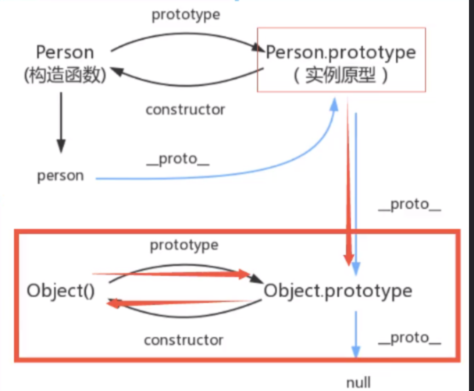

# 原型&原型链

## 1、原型&原型链基础

- __proto__:每个实例用来存`prototype`的属性,一定要牢记`__proto__`是实例化对象的
- 在实例化对象前，如果修改`prototype`，修改的是`constructor`里的`prototype`
- 

## 2、原型&原型链深入

- 原型链的继承&修改父类的属性
  - 可以修改引用值
  - 无法修改基础类型，会直接给自己的实例新加一个同名属性

```html
<body>
  <script>
    function Professor() {}
    Professor.prototype.tSkill = 'java';
    var pro = new Professor();
    

    function Teacher () {
      this.tSkill = "sql"
      this.tObj = {
        sal: 20000
      }
    }
    Teacher.prototype = pro
    var tea = new Teacher();

    function Student () {
      this.pSkill = 'html';
    }
    Student.prototype = tea;
    var stu = new Student();
    console.log("stu,",stu)
    stu.tSkill = "stuSql";
    //并无法修改基本类型，会在自己对象上新增一个同名属性
    console.log("stu2,",stu)
    stu.tObj.sal = 12000;
    //可以修改父类上的引用类型
    console.log("stu3,",stu)
  </script>
</body>
</html>
```

## 3、Chorme改版以后

- 看不到`__proto__`了
- `obj.[[ prototype ]]` -> `obj`的原型 -> `obj.__proto__`

## 4、有原型不代表有原型链

- 分析如下的例子
  - 只要不是一个完整的原型链，可以指向到Object.prototype，用__proto__都为undefined

```html
<body>
  <script>
    var obj1 = new Object()
    //原型指向Object
    console.log("obj1",obj1)
    var obj2 = {}
    //原型指向Object
    console.log("obj2",obj2)
    //这样写不会指向Object,相当于他的原型链断了
    var obj3 = Object.create(null)
    obj3.a = 1
    console.log("obj3",obj3)//点开无属性

    var obj4 = Object.create(obj3)
    console.log("obj4",obj4)//有原型为obj3，但是没有链
    console.log("obj4",obj4.__proto__)//因为没有链，所以为undefined

    // 只要不是一个完整的原型链，可以指向到Object.prototype，用__proto__都为undefined，继承并不是通过__proto__来实现的
    // obj4有原型，只是__proto__指针断了
    // MDN推荐使用Object.getPrototypeOf(obj),来获得对象的原型，而不是__proto__
  </script>
</body>
</html>
```
