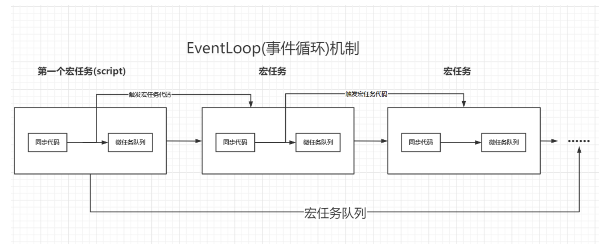
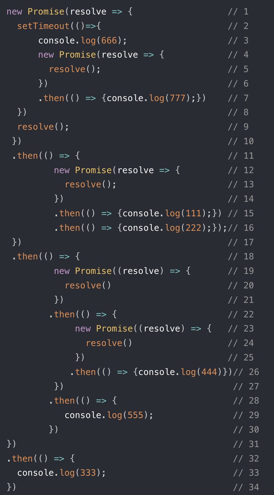

# promise

- 同步任务
- 异步任务
  - 宏任务：setTimeOut, setInterval, setImmediate(nodejs的),的回调函数，ajax的回调函数，I/O（nodejs）
  - 微任务：promise，process.nextTikc(nodejs)
  - 微任务是宏任务的组成部分,微任务与宏任务是包含关系,并非前后并列，宏任务包含微任务.如果要谈微任务,需要指出它属于哪个宏任务才有意义.

- 例子1

```js
// setTimeout被加入宏任务队列1
setTimeout(() => { //定时器1
    console.log(1);
}, 0)
new Promise((resolve) => {
    resolve();
}).then(() => { // (宏任务1中的微任务1）碰到Promise,将then的回调函数放入宏任务1的微任务队列中等待,线程继续往下.
    console.log(2)
})
console.log(3); 
//代码跑到最后一行输出3.此时同步代码执行完毕,开始检查当前宏任务中的微任务队列.
//运行微任务队列中的第一个then回调函数输出2.再检查微任务队列,没有发现其他任务.
//结果3，2，1
```



- 例子2

```js
new Promise((resolve)=>{
    //这里面是同步执行的
    console.log(1);
    resolve();
}).then(()=>{//.then进入微任务
    console.log(2);
 })
```

- 例子3



- 答案：1，2，3，4，5，6，7
- 线程执行第一行代码,同步执行Promise包裹的函数.
- 在第二行发现定时器,启动一个宏任务,将定时器的回调放入宏任务队列等待,线程直接跳到第9行执行
- 第9行执行完开始执行第11行代码发现then函数,放入当前微任务队列中.线程往后再没有可以执行的代码了,于是开始执行微任务队列.
- 执行微任务队列进入第12行代码,运行到第15行代码时发现then函数放入微任务队列等待.随后线程直接跳到第18行,碰到then函数放到微队列中.后续没有可执行的代码了,再开始执行微任务队列的第一个任务也就是第15行代码输出111.
- 15行执行完执行到16行碰到then回调放入微任务队列等待.随后线程跳到18行的微任务开始执行,一直执行到22行碰到then函数又放入微任务队列等待.此时线程继续往下跳到第- 32行碰到then函数放入微任务队列等待.后续没有可执行的代码了,再开始执行微任务队列的第一个任务.
- 线程跳到第16行执行微任务输出 222，随后又跳到22行执行下一个微任务,在26行处碰到then函数放入微任务队列等待.线程继续执行下一个微任务跳到32行输出 333.至此这一轮的三个微任务全部执行完毕清空,又开始执行微任务队列的第一个任务,线程跳到第26行输出 444.
- 线程执行到28行碰到then函数回调放入微任务队列等待.后续没有可执行的代码了,再开始执行微任务队列的第一个任务即29行代码输出 555.
所有微任务执行完毕,当前宏任务结束.线程开始执行下一个宏任务,线程跳到第三行输出 666.
- 线程继续往后第7行碰到then回调放入微任务队列,后续没有可执行的代码了,再开始执行微任务队列的第一个任务输出 777.第二个宏任务执行完毕.
