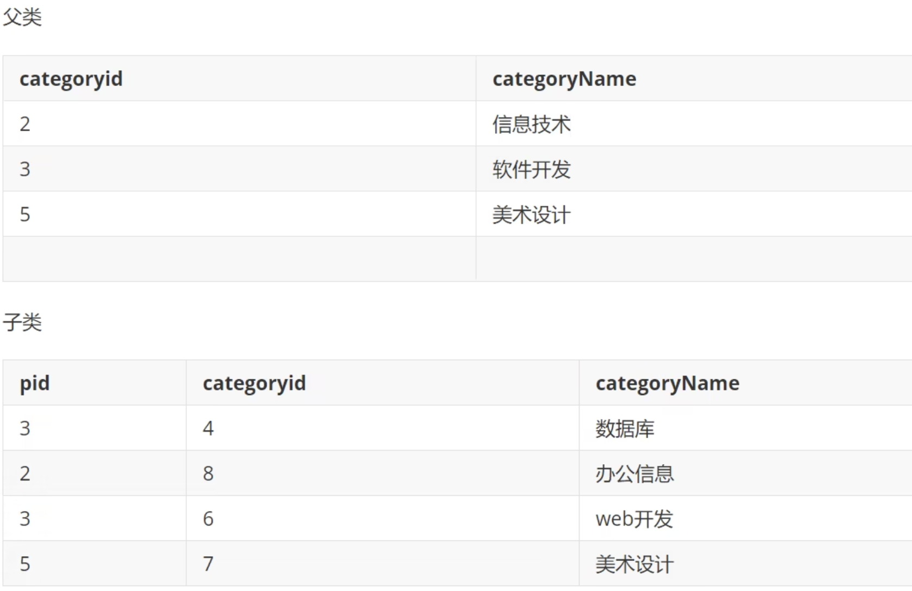

## 1、数据库

- 关系型SQL
  - 通过表和表之间，行和列之间的关系进行存储
  - Mysql，Oracle，SqlServer，DB2，SQLlite
- 非关系型Not only SQL
  - 对象存储，通过对象的属性来决定
  - redis，MongDB
- DBMS：数据库管理系统
- mysql：5.7稳，8.0新

## 2、连接数据库

```shell
mysql -u root -p12345678
//12345678是你的密码
```

## 3、命令

```shell
flush privileges --刷新权限
- 切换数据库
use xxxdatabase;
- 查看所有数据库
show databases;
- 创建数据库
create database xxx;
- 看表
show tables
- 
```

## 4、操作数据库

- 操作数据库

```sql
CREATE DATABASE IF NOT EXISTS mydatabase
DROP DATABASE IF EXISTS mydatabase 
```

- 操作数据库中的表

```sql
USE `mydatabase`
SHOW DATABASE `mydatabase`
```

- 操作数据库中的表中的数据

## 5、数据库中数据类型

- 数值
  - tinyint 1字节
  - smallint 2字节
  - int 4字节(常用)
  - mediumint 3字节
  - bigint 8字节
  - float 4字节
  - double 8字节
  - decimal 字符串形式的浮点数(金融计算的时候)
- 字符串
  - char 字符串固定大小的0-255
  - varchar 可变字符串0-65535(常用)
  - tinytext 微型文本 2^8-1
  - text 文本串 大型文本 2^16-1
- 时间日期
  - data:YYYY-MM-DD
  - time:HH:mm:ss
  - datetime:YYYY-MM-DD HH:mm:ss(常用)
  - timestamp：时间戳(常用)
  - year：年份
- null
  - 没有值，位置
  - 注意不要使用NULL进行运算，结果为NUll

## 6、数据库的字段属性

- Unsigned
  - 无符号整数
  - 不能声明为负数
- zerofill
  - 0填充
  - 不足的位数使用0来填充，int(3),5,005
- auto increament自增：通常用来设计唯一主键，必须是整数类型
- null/not null：是否必填

## 7、创建数据库表

```sql
CREATE TABLE IF NOT EXISTS `student` (
  -- '字段名' 列类型 [属性] [索引] [注释],
 `id` INT(4) NOT NULL AUTO_INCREMENT  COMMENT '学号',
 `name` VARCHAR(20) NOT NULL DEFAULT('狂野之裤')  COMMENT '姓名',
 `pwd` VARCHAR(20) NOT NULL DEFAULT('123456')  COMMENT '密码',
 `sex` VARCHAR(2) NOT NULL DEFAULT('男')  COMMENT '密码',
 `birthday` DATETIME DEFAULT  NULL COMMENT '生日',
 `address` VARCHAR(100) DEFAULT  NULL COMMENT '家庭住址',
 `email` VARCHAR(100) DEFAULT  NULL COMMENT '邮箱',
 PRIMARY KEY(id)
)ENGINE=INNODB DEFAULT CHARSET=utf8
-- [表类型][字符集设置][注释]
```

- 查看创建数据库的定义语句

```sql
SHOW CREATE DATABASE school -- 查看创建学生表的定义语句 
```

- 查看创建数据表的定义语句

```sql
SHOW CREATE TABLE student -- 查看创建学生表的定义语句 
```

- 显示表的结构

```sql
DESC student -- 显示表的结构
```

## 8、MyISAM和InnoDB的区别

- ENGINE=MYISAM //早些年使用的
- ENGINE=INNODB //默认使用的

- 事务支持
  - MYISAM不支持
  - INNODB支持
- 数据行锁定
  - MYISAM不支持
  - INNODB支持
- 外键约束
  - MYISAM不支持
  - INNODB支持
- 全文索引
  - MYISAM支持
  - INNODB不支持
- 表空间大小
  - MYISAM较小
  - INNODB约等于前者的2倍

## 9、修改和删除数据库表

- 修改表

```sql
ALERT TABLE teacher RENAME AS teacher1
```

- 赠加表字段(列属性)

```sql
ALERT TABLE teacher ADD age INT(11)
```

- 修改表字段(重命名，修改约束)

```sql
ALERT TABLE teacher MODIFY age INT(11) -- 重命名
ALERT TABLE teacher CHANGE age age1 INT(11) -- 修改约束
```

- 删除表字段

```sql
ALERT TABLE teacher DROP ag1 -- 重命名
```

- 删除尽量加上EXISTS判断

## 10、数据管理

#### 10.1、外键

- a表中x字段称为b表中y字段的约束
- 有外键的表删除不掉
- 创建表的时候没有外键，如何增加

```sql
ALTER TABLE `student`
ADD CONSTRAINT `FK_gradeid` FOREIGN KEY (`作为外键的列`) REFERENCES `哪个表` (`哪个字段`);
```

- 以上操作都是物理外键，数据库级别的外键，不建议使用
- `最佳实践`
  - 数据库就是单纯的表，只用来存数据，只有行列
  - 想要使用多张表的数据，想使用外键(程序实现)

#### 10.2、DML语言

- insert
- update
- delete

#### 10.3、增

```sql
-- 主键自增可以省略主键
-- 不写字段会一一匹配
INSERT INTO `grade`(gradname) values('大四')
INSERT INTO `grade`(gradeId,gradeName) values('1','大二'),('xx','xx')
```

#### 10.4、删

- delete

```sql
DELETE FROM `student` where id = 1
```

- TRUNCATE命令：完全清空一个表,表的结构和索引约束不会改变

```sql
TRUNCATE `student`
```

- 相同点，都能删除数据
- 不同点
  - TURNCATE 重新设置自增列，计数器会归零
  - TURNCATE 不会影响事务

#### 10.5、改

- update

```sql
-- update
UPDATE `grade` set `gradename`='Youngzx' WHERE gradeid = 1
-- 多个属性用逗号隔开
UPDATE `grade` set `gradename`='Youngzx',`email`='1216238955@qq.com' WHERE gradeid = 1
```

- BETWEEN 2 AND 5 ->在2到5之间
- AND &&
- OR ||

#### 10.6、查

```sql
-- 查询全部
SELECT * FROM student
-- 查询某列(起别名)
SELECT `phone` AS '手机号',`address` AS '地址' from student
-- 函数Concat
SELECT CONCAT('姓名:',StudentName) AS 新名字 FROM student
-- 去重 distinct
SELECT DISTINCT subjectno from result;//去除重复的subjectno
-- where 条件子句
SELECT `studentNo`,`StudentResult` from result
WHERE StudentResult >=20 AND StudentResult <=100
-- 模糊查询Like，%代表0到任意一个字符，_后面只有一个字 
SELECT `studentNo`,`studentname` from student
WHERE studentname LIKE '%强'
-- 模糊查询in(查询1001，1002，1003号学员),in是一个具体的值
SELECT `studentNo`,`studentname` from student
WHERE StudentNo IN ('1001','1002','1003')
-- 连表查询
-- 因为两个表都有studentNo，所以需要定义查询出来的是哪个表的
-- innerJoin（join on连接查询，where条件查询）
SELECT s.studentNo,studentName,SubjectNo,StudentResult
FROM student AS s
INNER JOIN result AS r
WHERE s.studentNo = r.studentNo/ON s.studentNo = r.studentNo
-- rightJoin:从右表中查询所有的值，即使左表没有匹配的值
-- leftJoin:从左表中查询所有的值，即使右表没有匹配的值
```

## 11、自连接

- 自己的表和自己的表连接
- 核心：一张表拆为2张


```sql
SELECT a.categoryname as 父,b.categoryname as 子
FROM category as a,category as b
WHERE a.categoryid = b.pid;
```

## 12、分页和排序

- orderBy(排序)

```sql
ORDER BY 某个字段 ASC -- 升序
ORDER BY 某个字段 DESC -- 降序
```

- limit(分页)

```sql
-- index size
-- (n-1) * pageSize
LIMIT 0,5 -- 第一开始加载五条数据
```

## 13、子查询和嵌套查询

- 在where语句中嵌套一个子查询语句

```sql
where (select * from ...)
```

## 14、mysql常用函数

## 15、聚合函数以及分组过滤

- COUNT()：COUNT(*),COUNT(1)几乎相等
- SUM()
- AVG()
- MAX()
- MIN()
- 分组

- where不能接聚合函数，groupby以后要用HAVING去过滤

```sql
GROUP BY 表名.字段
HAVING xxx > 80
```

## 16、拓展MD5

- MD5加密
- 不可逆
- MD5()

## 17、事务ACID原则

- 事务
  - 要么都成功,要么都失败
- 一组sql放在一个批次中去执行
- ACID原则
  - 原子性
  - 一致性
  - 隔离性
  - 持久性

## 18、测试事务实现转账

- mysql是默认开始事务自动提交的

```sql
SET autocommit = 0; -- 关闭
```

```sql
START TRANSACTION -- 标记一个事物的开启
INSERT xxx
INSERT xxx
COMMIT -- 提交，一旦提交就被持久化了
ROLLBACK -- 回滚
SAVEPOINT 保存点名 -- 设置一个事物的保存点 
BACK TO SAVEPOINT 保存点名 -- 回滚到保存点
RELEASE SAVEPOINT <保存点名> -- 撤销指定的保存点
```

## 19、索引介绍及索引分类

- 主键索引
  - 唯一的标识，主键不可重复，只能有一个列作为主键
- 唯一索引
  - 避免重复的列出现，唯一索引可以重复，多个列都可以标识为唯一索引
- 常规索引
  - 默认的，index，key关键字来设置
- 全文索引
  - 特定的数据库下才有，快速定位数据

- 索引的使用
  - 在创建表的时候给字段增加索引
  - 创建完毕后，增加索引

- 显示所有索引信息

```sql
SHOW INDEX FROM student
```

- 增加索引 (索引名)列名

```sql
ALTER TABLE `student` ADD FULLTEXT INDEX `studentName` (studentName)
```

- EXPLAIN去分析查找语句
- 时间长？添加索引

```sql
-- CREATE INDEX 索引名字 ON 表(字段)
CREATE INDEX id_app_user_name ON app_user(`name`)
```

## 20、索引原则

- 索引不是越多越好，后面查询再加
- 不要对经常变化的数据加索引
- 小数据量的表不需要加索引
- 索引一般加在常用查询的字段上

## 21、数据库用户管理

- 本质还是对mysql.user这张表进行增删改查

## 22、数据库备份

- 直接拷贝物理文件
- 可视化工具导出

## 23、如何设计数据库

- 减少冗余，减少数据耦合

## 24、三大范式

- 为什么需要数据规范化？
  - 信息重复
  - 更新异常
  - 插入异常
  - 删除异常

- 第一范式：每一列都是不可再分割的
- 第二范式：满足第一范式的前提下，每张表只描述一件事，每张表的每一列都要和逐渐相关，而不能只与主键某一部分相关
- 第三范式：满足前两个的前提下，确保每一列的数据都和主键直接相关，而不是间接相关
- 规范数据库，但是不一定要完完全全按照这个
- 性能和规范不可兼得，考虑商业化的需求和目标，关联查询不要超过3个表

## 25、JDBC
