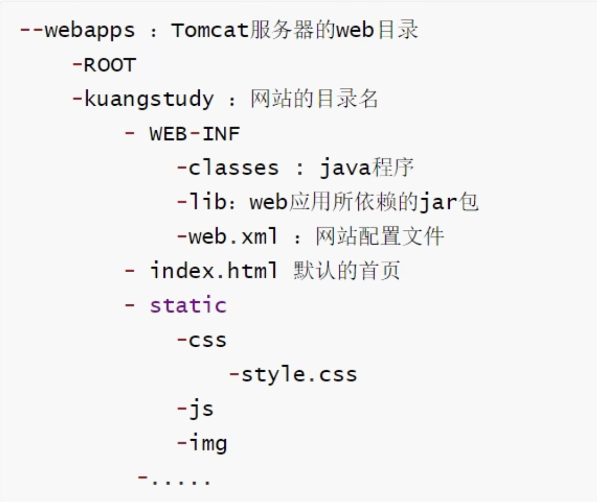

# Java Web

## 1、基本知识

- 技术栈：servlet/jsp，ASP，PHP

- 请求经过servlet/jsp返回给server，返回给前端界面

- servlet通过配置文件拦截你的请求，并进行相应处理，然后展示给你相应界面，那么servlet如何创建？ 这时候tomcat用到了，

- 它就是帮助你创建servlet的东西，所以也称web容器，没有它，没法运行web项目。相对应的web容器有很多，Servlet容器应该有三个基本任务：创建Request对象、创建Response对象和Servlet处理请求响应

- 技术历程：ASP->PHP->JSP/Servlet

- web服务器：tomcat，IIS

## 2、tomcat

- 中的webapps存放网站
- 启动./startup.bat
- 访问localhost:8080

## 3、http

- http：超文本传输协议，简单的请求响应
  - http：1.0:客户端与服务端连接只能获得一个资源
  - http：1.1：客户端与服务端连接可以获得多个资源
- https：安全
