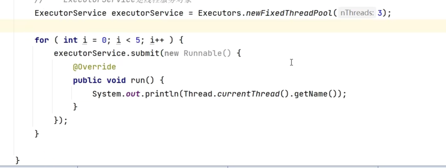
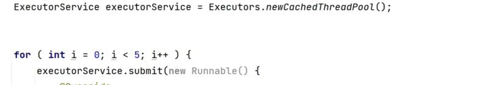
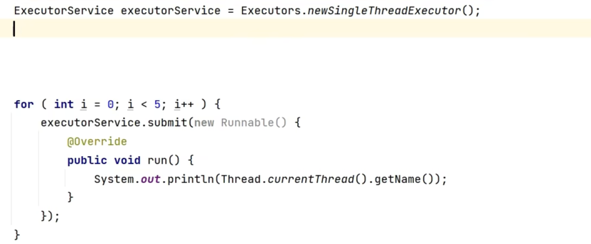
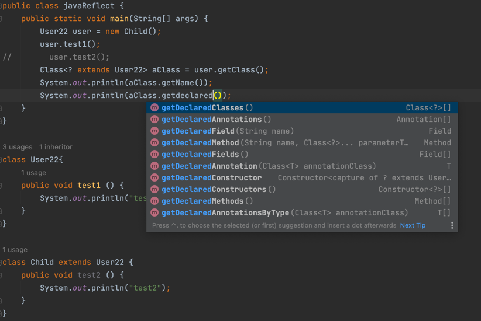

## 1、数据类型
- 基本数据类型
  - 数值
    - 整数：byte，short，int，long
    - 浮点类型：float，double
  - 字符
    - char
  - 布尔
    - boolean
- 引用数据类型
  - 类，String
  - 接口
  - 数组
  - 枚举
  - 特殊类型值：null
## 2、数据类型转换
- 隐式类型转换（小转大）
  - byte->short->int->long->float->double
- 强制转换（大转小）
## 3、计算
- 计算是有类型的，哪个类型大就取谁：1.0/2（double/int=double）
- 如果是复合赋值运算符数据类型不会改变
```java
int i = 1;
i = i + 1;

byte b1 = 10;
b1 += 20;//正确
b1 = b1 + 20;//错误。byte不能赋值给int
```
- &与运算，｜或运算
- &&短路与运算，||短路或运算
## 4、静态方法
- 静态方法/属性不用实例去调用，可以直接调用
- 有类就有静态方法了
  - 变量是在栈中
  - 对象是在堆中
- 静态代码块，类的信息加载完成后会自动调用静态代码块

## 5、包
- java中存在不同包的相同名称的类，可以用包名进行区分/import
- new java.util.Date() / import

## 6、构造方法

## 7、继承，封装，多态
- 继承
  - 关键字extends
  - super.属性，父类的属性，this.属性，自己的属性
  - 构造方法
    - 先有对象，才有构造方法
    - 子类的构造方法会默认调用父类的无参构造:super()
    - 如果父类的构造方法被修改为有参数,需要手动调用
- 多态
  - 一个对象在不同场景展现的不同形态和状态
  - 对对象的使用场景进行约束 
  - 一个对象能使用什么方法/属性，取决于引用变量的"类型"(看左边)
  - 一个对象的方法具体使用是要看具体的"对象"的(看右边 )
  - 具体的属性使用是不需要看对象的，属性在哪里声明在哪里使用
  ```java
  class Test {
    public static void main(String[] args) {
      Person p1 = new Man();
      p1.sayMan();//错误
    }
  }
  class Person {
      
  }
  class Man extends Person {
      void sayMan(){
        System.out.println("i am a man");
      }
  }
  ```
## 8、重载
- 方法名字相同，参数(类型，个数)/返回值不同。
## 9、重写
- 父类方法其实主要体现共同性，无法在特殊场合下使用
- 如果子类对象需要在特殊场合下使用，就需要重写方法的逻辑
- 并不是说父类的方法会被覆盖掉，只是在
- 当前场合不使用，如果使用super关键字还是可以访问的
## 10、访问权限
- private：私有，同一个类中可以使用
- default：默认权限，不设定权限jvm会提供默认权限，包权限
- protected：受保护的权限，子类可以访问
- public：公共的，任意使用
## 11、内部类
- 内部类：类中声明的类
- java不允许外部类使用private修饰
- 因为内部类可以看作是外部类的属性，所以需要构建外部类对象才可以使用 
- `OuterClass.InnerClass innerClass = outer.new InnerClass()`
## 12、单例模式
- 频繁创建对象内存开销大，使用单例模式
```java
public class Instance {
    public static void main(String[] args) {
        User instance1 = User.getInstance();
        User instance2 = User.getInstance();
        User instance3 = User.getInstance();
        System.out.println(instance3 == instance1);
        System.out.println(instance1.equals(instance2));
    }
}

class User{
    private static User user = null;
    private String name;
    public static User getInstance () {
        if(user == null){
            user = new User();
        }
        return user;
    }
}
```
## 13、final
- java提供了一种语法可以在数据初始化后不被修改，使用关键字final
- final可以修饰变量，变量的值一旦初始化后无法修改
- finale可以修饰属性，那么jvm无法自动进行初始化，需要自己进行初始化，属性值不能发生改变
- final可以修饰`方法`,这个方法不能被子类重谢
- final可以修饰`类`,这样没有子类
- final不可以修饰`构造方法`
- final可以修改方法的参数，一旦修饰，参数就无法修改
## 14、抽象类/抽象方法
- 类的概念很抽象的时候，需要抽象类/抽象方法
- 抽象方法：只有声明没有实现`abstract 返回值类型 方法名`
- 抽象类：有/没有 抽象方法
```java
public class abstract01 {
    public static void main(String[] args) {
        Chinese2 c1 = new Chinese2();
        c1.eat();
    }
}

abstract class People{
    public abstract void  eat();
}
 
class Chinese2 extends People {
    //抽象类无法直接构建对象，但是可以通过子类间接构建对象
    public void eat(){
        System.out.println("中国人用筷子吃饭");
    }
}
```
## 15、接口
- 接口简单理解为规则
- 基本语法，`interface { //规则属性//规则行为 }`
- 接口属性应该是静态的
- 接口方法应该是抽象的
- 类需要实现接口，而且可以实现多个接口
## 16、枚举类：enum
- Java 枚举是一个特殊的类，一般表示一组常量，比如一年的 4 个季节，一个年的 12 个月份，一个星期的 7 天，方向有东南西北等
- Java 枚举类使用 enum 关键字来定义，各个常量使用逗号 , 来分割。
- 枚举类不能创建对象，是在枚举类内部自己创建的
```java
public class javaEnum {
    public static void main(String[] args) {
        System.out.println(City.BEIJING.name);
        System.out.println(City.SHANGHAI.name);
    }
}

enum City {
    BEIJING("北京",10001),SHANGHAI("上海",10002);
    public String name;
    public int code;
    City(String name,int code) {
        this.code = code;
        this.name = name;
    }
}
```
## 17、匿名类
- 某些场合类的名字不重要，匿名类
- 匿名类直接实现抽象类，不用创建类去实现它
```java
public class nimingclass {
    public static void main(String[] args) {
        SayHello sayHello = new SayHello();
        sayHello.SayHello(new Person11(){
            public String name(){
                return "Youngzx";
            }
        });
    }
}

abstract class Person11 {
    public abstract String name();
}

class SayHello {
    public void SayHello(Person11 person11){
        System.out.println("hello" + person11.name());
    }
}

```
## 18、bean规范
- 数据模型
- Bean类的设计规范
  - 类要求必须含有无参，公共的set，get方法
## 19、作用域
- 子类的静态方法中是不允许用super去调用父类的属性方法的
- 因为静态方法不一定有对象，在类建立的时候就有了静态方法
- 如果仍让需要父类的属性或方法可以用`父类名.父类方法`
## 20、常用类和对象
#### 20.0、Object
- 可以重写toString方法
- hashCode()获取对象的内存地址
- equals()判断两个对象是否相等
- getClass()获取对象的类型信息
#### 20.1、数组
- 一种连续存储的数据结构
```java
public class javaArray {
    public static void main(String[] args) {
        String[] names = new String[3];
        for (int i = 0; i < names.length; i++) {
            names[i] = "Youngzx" + i;
        }
        System.out.println("names"+names[0]+names[1]+names[2]);//namesYoungzx0Youngzx1Youngzx2
    }
}
```
- 二维数组
```java
String[][] names = {{1,2,3},{2,3,4}};
```
#### 20.2、字符串
- substring
- split
- trim
- repalce
- repalceAll按规则转换
- toLowerCase
- toUpperCase
- toCharAray返回一个char[]
- getBytes返回一个byte[]
- charAt(index)
- indexOf("str")
- lastIndexOf
- contains
- endsWith
- isEmpty
- StringBuilder：构建字符串
```java
StringBuilder s = new StringBuilder();
for(int i = 0 ; i < 100 ; i++){
    s.append("abv")
}
```
#### 20.3、包装类
- 基本数据类型byte，short，int，long，float，double，char，boolean
- 包装类：Byte，Short，Integer，Long，Float，Double，Character 
- 自动装拆箱
#### 20.4、日期类
- System.currentTimeMillis()时间戳
- Date日期类（java.util.Data）
```java
//SimpleDateFormat
//java格式化日期格式：
//y(Y)->年：yyyy
//m(M)->MM:月份，mm:分钟 
//d(D)->dd:一个月重的日期，D:一年重的日志
//h(H)->h:12进制，HH:24进制
//s(S)->s:秒，S:毫秒
SimpleDateFormat sdf = new SimpleDateFormat("yyyy-MM-dd HH:mm:ss.SSS");//date->string
sdf.parse("2022-6-21");//string->data
d.setTime(System.currentTimeMills)//根据时间戳构建指定的日期对象
```
#### 20.5、日历类
- 抽象类，使用他的静态方法
- Calender.getInstance()
- instance.get("Calendar.YEAR")...
#### 20.6、工具类
#### 20.7、比较
- ==基本数据类型比大小，引用数据类型比内存地址
- 对象相等一般要重写equals，hashCode
## 21、异常
- 类型转换错误
- stackoverflow递归没有跳出逻辑
- 可以通过代码恢复正常逻辑执行的异常，称为运行时异常，runTimerException
- 不可以通过代码恢复正常逻辑执行的异常，称之为编译器异常，exception
```java
//可能会出现异常的代码放在try里
//catch里方抛出异常对象的引用
//先捕捉范围小的异常，再捕捉范围大的异常
try{
}catch{
}finally{
}
```
- 例如调用一个为null对象的成员属性/方法时候会出现空指针异常
- 数组越界异常
- ClassCastException
- 如果方法中可能会出现问题，那么需要提前声明，告诉其他人，我的方法可能会出现问题，需要使用`throws`
- 如果程序中需要手动抛出异常，用`throw`关键字\
- 自定义异常
  - 最好继承RuntimeException，因为非运行期异常需要手动在类上throws
  - 继承以后可以抛出自定义异常
```java
public class DiyException {
    public static void main(String[] args) {
        String name = "admin";
        String pwd = "admin";

        try{
            Login(name,pwd);
        }catch (Exception e){
            System.out.println(e);
        }

    }
    public static void Login(String name,String pwd) {
        if(!"admin".equals(name)){
            throw new AccountException("账户名不正确");
        }
        if(!"admin".equals(pwd)){
            throw new PwdException("密码不正确");
        }
        System.out.println("登陆成功");
    }
}

class AccountException extends RuntimeException {
    public AccountException(String msg) {
        super(msg);
    }
}

class PwdException extends RuntimeException {
    public PwdException(String msg) {
        super(msg);
    }
}
```
## 22、集合
- collection
- java中的集合是一个名次，数据的一种容器，java提供类完整的集合框架
- java集合框架中就包含类对不确定个数的数据处理的集合类
- 集合分为两大数据体系：
  - 单一数据体系：Collection
  - 成对出现的数据体系：Map
- 常用接口和类：
  - Collection
    - List：按插入顺序保存数据，数据可以重复，ArrayList，LinkedList
    - Set：集，无序保存，数据不能重复，HashSet
    - Queue：队列
  - Map
    - hashMap
    - hashTable
#### 22.1、ArrayList
- 不需要传递构造参数，直接new即可，底层数组为空数组
- 构造函数传递的参数若为int，则为设定底层数组的长度
- 构造函数传递的参数若为一个Collection集合类型的值，用于将其他集合中的数据放置在当前集合中 
- 方法
  - add(),增加数据，若集合中没有任何数据则会创建长度为10的数组
  - size(),得到集合中数据的长度
  - get(index),得到指定位置的数据
  - set(index,value),修改index位置的值为value,并返回修改前的值
  - remove(index),删除index位置的数据，返回的是删除的值
  - isEmpty()
#### 22.2、LinkedList
- 可以前插，可以后插，无索引
- 方法
  - add()
  - addAll()
  - addFirst(),addLast()
  - get() 
  - set(index,value)
  - remove(value)
  - removeFirst()
  - removeLast()
  - indexOf()
  - push()
  - contains()
  - element()，获取第一个
  - pop(),弹出第一个
## 23、泛型
- < T >
- 从集合中获取的对象类型为object
- 如果想要执行对象方法，需要进行强制类型转换
- ArrayList<xxxLeixing> arr = new ArrayList()
- 简化类型的判断
## 24、IO
## 25、线程
- 声明自定义线程类：重写运行指令(run)
- 线程的生命周期
  - new新建
  - runnable可运行
  - terminated
  - blocked
  - waiting
  - timed waiting
- 串行和并发
  - 串行：执行完一个线程再执行下一个t1.join();t2.join()
  - 并发：线程之间相互独立
- 线程休眠
  - sleep(time)：Thread静态方法，可以在任意代码使用，sleep其他线程无法抢占
- 线程等待
  - wait():Object成员方法，只能使用在同步代码中，wait其他线程可以抢占
```java
Thread t = new Thread(()->{
    sout("线程执行")
})
```
- 线程池
  - 所谓线程池，其实就是线程对象的容器
  - java中有4中比较常见的线程池
  - 1.ExecutorService：`newFixedThreadPool(numbers)`固定数量线程池
  - 
  - 2.ExecutorService：`newCachedThreadPool()`根据需求动态创建线程
  - 
  - 3.ExecutorService：`newSingleThreadPool()`单一线程
  - 
  - 4.ExecutorService：`newScheduleThreadPool()`定时调度线程
- 同步
  - `synchronized`用于同步的对象  
- 线程安全
  - java会给每个线程创建一个栈内存
  - 多个线程在并发执行时，修改类共享内存中对象的属性，导致的数据冲突问  题
## 26、反射
- 父类类型声明的子类对象如何调用子类的方法？反射
- getClass()得到字节码文件(16进制编码  )
- 
- 类加载器
  - Java中分为三种类
    - java中核心类库中的类，string，object
    - jvm软件平台开发商
    - 自己写的类
  - 对应的类加载器也有三种
    - Boot核心
    - Platform平台
    - AppClass应用加载器
  - 类名.class.getClassLoader()
```java
//反射小练习
public class javaReflectTest {
  public static void main(String[] args) throws Exception {
    //使用反射登陆
    //得到反射class
    Class<Emp> empClass = Emp.class;
    //通过构造函数对象，构建反射对象
    Constructor<Emp> declaredConstructor = empClass.getDeclaredConstructor();
    Emp emp = declaredConstructor.newInstance();
    Field account = empClass.getField("account");
    Field pwd = empClass.getField("pwd");
    account.set(emp,"admin");
    pwd.set(emp,"admin");

    Method login = empClass.getMethod("login");
    login.invoke(emp);
  }
}

class Emp {
  public String account;
  public String pwd;
  public void login() {
    if("admin".equals(account) && "admin".equals(pwd)){
      System.out.println("登陆成功");
    }else {
      System.out.println("账号或密码错误");
    }
  }
}
```
- 获取反射的方法
  - 类名.class
  - new 类名().getClass()
  - Class.forName("包名.类名")
- 常见异常
  - ClassNotFoundException
  - NoSuchMethodException
  - IllegalArgumentException
  - NoSuchFieldException
  - IllegalAccessException